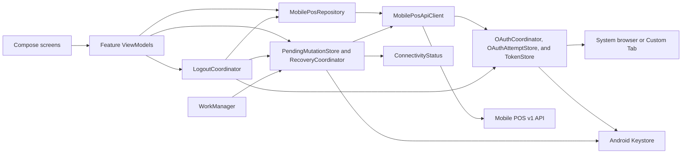

# Android Mobile POS Architecture

## Scope and Authority

This document defines Android ownership and component boundaries. Backend business behavior and wire contracts remain authoritative in the reviewed documents under [`backend/`](backend/README.md).

## Verified Baseline

- The repository is a single `app` module.
- `minSdk` is 23, `targetSdk` is 36, and `compileSdk` is Android 36.1.
- Task 1B replaced the generated Compose starter with an XML/ViewBinding sign-in shell and verified it on API 23 and API 36.
- Task 2 API transport work exists but remains incomplete; see [`implementation-plan.md`](implementation-plan.md) for current evidence and gaps.
- Authentication, persistence, repository, recovery, and POS feature workflows do not yet exist.
- Backup and device transfer exclude application data, cleartext traffic is disabled, and release optimization remains disabled.

Task 1B remains valid historical implementation evidence. The approved UI direction now uses Kotlin, Jetpack Compose, and Material 3 for new UI work. The XML/ViewBinding shell is replaced only by a separately approved Compose migration after Task 2 is complete.

## Architecture Principles

- ERPNext is the source of truth.
- Android consumes only stable v1 DTOs and never Frappe document JSON.
- Network DTOs, domain state, and immutable UI state are separate.
- One repository boundary owns Mobile POS API calls and DTO mapping.
- Composables render state and emit events; ViewModels and repositories own orchestration.
- Mutations are persisted before network transmission.
- Security, idempotency, accessibility, and recovery are not optional simplifications.
- The application remains one Gradle module until measured build or ownership needs justify another module.
- UI references may inform visual hierarchy and interaction only; their runtime architecture is not imported.

## Runtime Shape

## UI and Navigation

- `MainActivity` becomes a Compose host after the approved Compose-foundation task.
- Navigation Compose owns root destinations: Home, Products, Cashier, Reports, and More.
- Cashier is the elevated center action in a persistent, safe-area-aware bottom navigation bar.
- Authentication, profile selection, opening, recovery, payment, receipt, return, and closing are flow destinations outside or above the persistent tab shell as appropriate.
- Route arguments contain only small, non-sensitive identifiers. DTOs, tokens, request bodies, and cart graphs never enter navigation saved state.
- Feature ViewModels expose immutable `StateFlow` state and receive explicit UI events.
- Back navigation cannot resubmit a mutation.
- A recovery destination intercepts startup before normal mutation screens when an unresolved record exists for the authenticated user.
- Phone Cashier uses a floating cart summary and modal bottom sheet. Expanded widths use a persistent cart pane.
- Layouts support phone, tablet, portrait, landscape, display cutouts, navigation insets, and font scale 1.5 without hiding primary actions.

Primary flow destinations are:

- Sign in.
- Profile selection.
- Opening.
- Home dashboard.
- Products.
- Cashier workspace.
- Customer search.
- Payment.
- Receipt.
- Reports unavailable or approved report data.
- Sale history and detail.
- Return.
- Closing preview and status.
- More and theme settings.
- Recovery.

## UI Design System

The UI design source is [`ui-ux-reference-design.md`](ui-ux-reference-design.md).

- Use semantic light/dark color tokens rather than screen-specific colors.
- Use configurable primary accent, neutral application background, elevated surface cards, semantic success/warning/destructive states, and consistent spacing/radius/elevation.
- Bundle Plus Jakarta Sans only from a pinned OFL-licensed source with its license notice; use the closest bundled Android sans-serif fallback if API 23 verification fails.
- Use Material Icons or another properly licensed Android icon set. Do not copy reference branding.
- Persist only non-sensitive theme mode and accent preference through application-private `SharedPreferences`; add no persistence framework.
- Keep populated fake data in `app/src/debug/` previews and test source sets. Release runtime never includes fake ERPNext records.
- Major screens provide loading, empty, populated when integrated, offline, unavailable, and error states.
- Every interactive target is at least 48 dp, supports TalkBack semantics and keyboard focus, and never conveys status by color alone.

## Component Responsibilities

| Component | Responsibility | Lifetime |
| --- | --- | --- |
| `MobilePosApplication` | Creates a small manual application container | Process |
| `OAuthCoordinator` | Starts authorization, validates redirect, exchanges and refreshes tokens | Process |
| `OAuthAttemptStore` | Keystore-backed encrypted atomic active-attempt persistence | Process |
| `TokenStore` | Keystore-backed encrypted atomic origin-bound token persistence | Process |
| `CanonicalBackendOrigin` | Validates and serializes one canonical backend origin | Process |
| `MobilePosApiClient` | Exact-origin bearer transport, bounded read refresh, stable/native parsing, and redaction | Process |
| `MobilePosRepository` | Endpoint mapping and sole ownership of bootstrap/capability state | Process |
| `ConnectivityStatus` | Conservative `Online`, `KnownOffline`, or `Unknown` platform snapshot | Process |
| `PendingMutationStore` | Encrypted durable mutation records using `SQLiteOpenHelper` | Process |
| `RecoveryCoordinator` | Serializes mutation execution, replay, and terminal persistence | Process |
| `RetryPendingMutationWorker` | Durable network-constrained retry only | Worker |
| `LogoutCoordinator` | Blocks unresolved logout and clears all local sensitive state after acknowledgment | Process |
| Feature ViewModel | Immutable screen state, user intent, cancellation, and navigation events | Navigation destination |
| Composable | Rendering, semantics, input forwarding, and preview composition | Composition |

No dependency-injection framework, ORM, Retrofit, image framework, or custom navigation framework is introduced without a measured approved need.

## Planned Dependencies

Use Android platform and AndroidX first. The expected narrow dependency set is:

- Jetpack Compose BOM, Material 3, UI tooling for debug previews, Lifecycle/ViewModel Compose integration, and Navigation Compose.
- WorkManager for durable recovery.
- Kotlin coroutines for structured concurrency.
- OkHttp for cancellable HTTPS transport and MockWebServer tests.
- Kotlin serialization for explicit DTOs with unknown-field tolerance.
- AppAuth for Android for standards-based OAuth Authorization Code and PKCE.
- UI Automator in Android tests only for the real cross-application browser journey that Compose testing cannot drive.

Each dependency must have a maintained API 23-compatible stable release and a specific task-level need. Dependency additions are reviewed independently.

## Data Boundaries

### Network DTOs

- Mirror only documented v1 fields.
- Decode decimal values as `String`.
- Ignore additive unknown response fields.
- Preserve `meta.request_id`, `server_time`, and `replayed`.
- Never expose Frappe internals to UI state.

### Domain and UI Models

- Use `BigDecimal` only for non-authoritative display snapshots and user-entered amounts allowed by an approved contract.
- Mark estimated and snapshot values explicitly.
- Use server-returned values for receipt, invoice, return, and closing results.
- Do not persist ERPNext document graphs.
- Do not aggregate a bounded `sales.list` page and present it as a complete daily dashboard or report.

### Preview and Unavailable Data

- Debug previews may use synthetic populated fixtures marked `Demo data`.
- Release runtime without integration renders an honest unavailable, empty, offline, or error state.
- Current v1 endpoints do not supply complete dashboard aggregates, complete low-stock alerts, or report analytics. Adding live complete analytics requires a separately approved backend contract.
- Discount editing, camera capture, overpayment/change calculation, printer integration, and synchronization controls remain absent or disabled until their separate gates pass.

### Local Persistence

Persistent application data is limited to:

- Encrypted active OAuth authorization attempt.
- Encrypted OAuth token state.
- Encrypted unresolved mutation request and recovery state.
- Minimal non-sensitive configuration required to reach the approved site.
- Non-sensitive theme mode and accent preference.

Every pending mutation is bound to the normalized HTTPS origin and configured OAuth client identity that created it. Reprovisioning never redirects a pending request to another site.

`RecoveryCoordinator` maps validated domain input to one endpoint DTO, serializes it once as UTF-8 JSON with the shared serializer, and persists the exact bytes, content type, serializer identity, and local format version. Replay sends those bytes without reconstruction. Semantic canonicalization remains server-owned. An unknown local format enters `manual_recovery`.

`MobilePosRepository` is the sole writer of the in-memory bootstrap and capability snapshot. Feature ViewModels consume but never infer or persist capabilities. A process starts with every mutation disabled until bootstrap succeeds.

The repository performs one coalesced refresh after:

- Successful authentication or authentication recovery.
- Explicit profile selection or profile change.
- Successful or replayed opening completion.
- Successful or replayed sale completion.
- Successful or replayed return completion.
- Accepted closing submission.
- Terminal closing status recovery.

Bootstrap completion, capability observation, UI rendering, and refresh failure never trigger another refresh. A failed required refresh keeps mutations disabled until explicit Retry.

Catalog, customer, and history responses remain in memory in the MVP. There is no local ledger, invoice database, durable offline catalog, or reference-database import.

`LogoutCoordinator` is the only normal logout boundary. It rejects every unresolved mutation state and, after terminal acknowledgment, clears tokens, active OAuth attempts, repository read caches, opening input, cart, receipt, return input, closing input/status, encrypted terminal bodies, and navigation state before routing to sign in.

## Concurrency and Lifecycle

- Coroutines are scoped to ViewModels, WorkManager, or application services.
- A known-offline new mutation returns `NotStartedOffline` before UUID allocation or persistence. Existing pending recovery remains unchanged.
- Ambiguous or stale connectivity is `Unknown` and follows normal transport.
- Network restoration never starts a never-prepared action; it may satisfy the constraint of an already persisted eligible mutation worker.
- Search and quote jobs are cancelled when their inputs become obsolete.
- Only one unresolved logical mutation is active per authenticated user.
- Token refresh is serialized.
- WorkManager is used only after a mutation has been durably prepared.
- Immediate foreground requests do not use WorkManager.
- Activity, composition, and browser callback references are never retained by application-scoped objects.

## Network Flow

1. A composable emits an event to its ViewModel.
2. The ViewModel calls `MobilePosRepository`.
3. The repository maps domain input to an explicit request DTO.
4. Read requests are sent directly.
5. Mutation requests first pass through `RecoveryCoordinator`.
6. The coordinator generates the lowercase UUID, serializes once, and persists the UUID and exact serialized bytes before transport.
7. `MobilePosApiClient` obtains a token bound to the exact canonical origin and sends the stored bytes with the same UUID.
8. The terminal response is persisted before UI success is emitted.
9. DTOs map to immutable domain and UI models.

## Security Boundaries

- Manifest rejects cleartext traffic.
- Only the OAuth callback component is exported for redirect handling.
- All other non-launcher components default to `exported=false`.
- Redirect action, URI, state, and lifecycle delivery are validated.
- OAuth authorization uses only the fixed Frappe authorize path; token exchange and refresh use only the fixed Frappe token path on the canonical origin. Discovery, dynamic endpoints, and redirects are rejected.
- Keystore encryption uses AES-GCM with a non-exportable key generated on API 23 or newer.
- Backup and device transfer exclude application data.
- Network and application logs use an allowlist and never log credentials or sensitive bodies.
- Compose previews, screenshots, semantics trees, and debug fixtures contain synthetic data only.

## Performance Boundaries

- Page size defaults to 20 and is capped at 100.
- Cart rows are capped at 50.
- Search debounce is 300 ms.
- Lazy lists and grids render bounded projections with stable keys.
- No image framework is required before an approved measured need.
- No unnecessary polling or broad in-memory ERPNext objects are allowed.
- Disk, crypto, JSON, and network work run off the main thread.

## Stop Conditions

Implementation stops when:

- Task 2 transport is incomplete before the Compose migration begins.
- A required backend phase or contract fixture is unavailable.
- Exact OAuth redirect or provisioning details are missing for authentication.
- The OAuth attempt lifetime or configuration provisioning mechanism is not approved.
- Android would need to calculate an authoritative total, change, discount, or refund locally.
- Decimal input, serial requote, payment-mode, payable, or refund semantics are unresolved for the active task.
- A dashboard or report would require uncontracted aggregation or would mislabel preview data as live ERPNext data.
- The active staging task lacks its externally owned lost-response or queued-closing procedure.
- A dependency cannot support API 23 or has no demonstrated requirement.
- A test, lint, debug build, release build, device, accessibility, security, or intended diff review fails.
- Work crosses into a later Android phase without explicit approval.
