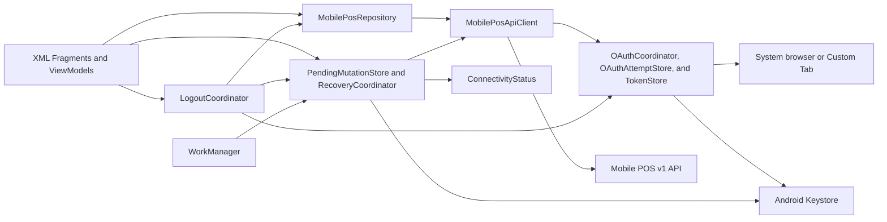

# Android Mobile POS Architecture

## Scope and Authority

This document defines Android ownership and component boundaries. Backend
business behavior and wire contracts remain authoritative in the approved
`roti_ropi_pos/docs/mobile-pos/` documents.

## Current Baseline

- The repository is a single `app` module.
- `minSdk` is 23, `targetSdk` is 36, and `compileSdk` is Android 36.1.
- The generated application currently uses an unapproved Compose starter.
- XML layouts, ViewBinding, networking, authentication, persistence, and POS
  workflows do not yet exist.
- Backup is enabled with unconfigured template rules.
- Release optimization is disabled.
- Existing tests are generated placeholders.
- The baseline Gradle gate currently fails before compilation because
  `androidx.core:core-ktx:1.19.0` and
  `androidx.lifecycle:lifecycle-runtime-compose:2.11.0` require compile SDK 37
  while the project compiles against Android 36.1.

The first implementation phase uses two separately approved tasks: first resolve
the dependency and compile SDK mismatch, then replace rather than extend the
Compose starter. Any compile SDK change requires explicit review while
`minSdk 23` remains fixed.

## Architecture Principles

- ERPNext is the source of truth.
- Android consumes only stable v1 DTOs and never Frappe document JSON.
- Network DTOs, domain state, and UI state are separate.
- One repository boundary owns Mobile POS API calls and DTO mapping.
- Mutations are persisted before network transmission.
- Security, idempotency, accessibility, and recovery are not optional
  simplifications.
- The application remains one Gradle module until measured build or ownership
  needs justify another module.

## Runtime Shape

## UI and Navigation

- `MainActivity` hosts one `NavHostFragment`.
- Destinations use Fragments, XML layouts, and ViewBinding.
- AndroidX Navigation is used without Safe Args; route arguments are small,
  non-sensitive identifiers.
- Large DTOs, tokens, request bodies, and cart graphs are never put in Bundles.
- Feature ViewModels expose immutable `StateFlow` state and receive UI events.
- Fragments collect state with `viewLifecycleOwner.lifecycleScope` and
  `viewLifecycleOwner.repeatOnLifecycle(STARTED)`.
- ViewBinding references are cleared in `onDestroyView`.
- Back navigation cannot resubmit a mutation.
- A recovery destination intercepts startup before normal mutation screens when
  an unresolved record exists for the authenticated user.

Primary destinations are:

- Sign in.
- Profile selection.
- Opening.
- Sale workspace.
- Customer search.
- Payment.
- Receipt.
- Sale history and detail.
- Return.
- Closing preview and status.
- Recovery.

## Component Responsibilities

| Component | Responsibility | Lifetime |
| --- | --- | --- |
| `MobilePosApplication` | Creates a small manual application container | Process |
| `OAuthCoordinator` | Starts authorization, validates redirect, exchanges and refreshes tokens | Process |
| `OAuthAttemptStore` | Keystore-backed encrypted atomic active-attempt persistence | Process |
| `TokenStore` | Keystore-backed encrypted atomic origin-bound token persistence | Process |
| `CanonicalBackendOrigin` | Validates and serializes one canonical backend origin | Process |
| `MobilePosApiClient` | Exact-origin bearer transport, bounded read refresh, stable/native parsing, and redaction | Process |
| `MobilePosRepository` | Endpoint mapping and sole ownership of bootstrap/capability state | Process |
| `ConnectivityStatus` | Conservative `Online`, `KnownOffline`, or `Unknown` platform snapshot | Process |
| `PendingMutationStore` | Encrypted durable mutation records using `SQLiteOpenHelper` | Process |
| `RecoveryCoordinator` | Serializes mutation execution, replay, and terminal persistence | Process |
| `RetryPendingMutationWorker` | Durable network-constrained retry only | Worker |
| `LogoutCoordinator` | Blocks unresolved logout and clears all local sensitive state after acknowledgment | Process |
| Feature ViewModel | Screen state, user intent, cancellation, and navigation events | Navigation destination |
| Fragment | Rendering and input binding only | Fragment view |

No dependency-injection framework, ORM, Retrofit, image loader, or custom
navigation framework is introduced.

## Planned Dependencies

Use Android platform and AndroidX first. The expected narrow dependency set is:

- AndroidX AppCompat, Fragment, Lifecycle/ViewModel, Navigation, RecyclerView,
  and WorkManager.
- Material Components for XML widgets and accessibility behavior.
- Kotlin coroutines for structured concurrency.
- OkHttp for cancellable HTTPS transport and MockWebServer tests.
- Kotlin serialization for explicit DTOs with unknown-field tolerance.
- AppAuth for Android for standards-based OAuth Authorization Code and PKCE.
- UI Automator in Android tests only for the real cross-application browser
  journey that Espresso cannot drive.

Each dependency must have a maintained API 23-compatible stable release and a
specific task-level need. Dependency additions are reviewed independently.

## Data Boundaries

### Network DTOs

- Mirror only documented v1 fields.
- Decode decimal values as `String`.
- Ignore additive unknown response fields.
- Preserve `meta.request_id`, `server_time`, and `replayed`.
- Never expose Frappe internals to UI state.

### Domain and UI Models

- Use `BigDecimal` only for non-authoritative display snapshots and user-entered
  amounts.
- Mark estimated values as estimates.
- Use server-returned values for receipt, invoice, return, and closing results.
- Do not persist ERPNext document graphs.

### Local Persistence

Persistent application data is limited to:

- Encrypted active OAuth authorization attempt.
- Encrypted OAuth token state.
- Encrypted unresolved mutation request and recovery state.
- Minimal non-sensitive configuration required to reach the approved site.

Every pending mutation is bound to the normalized HTTPS origin and configured
OAuth client identity that created it. Reprovisioning never redirects a pending
request to another site.

`RecoveryCoordinator` maps validated domain input to one endpoint DTO,
serializes it once as UTF-8 JSON with the shared serializer, and persists the
exact bytes, content type, serializer identity, and local format version. Replay
sends those bytes without reconstruction. Semantic canonicalization remains
server-owned. An unknown local format enters `manual_recovery`.

`MobilePosRepository` is the sole writer of the in-memory bootstrap and
capability snapshot. Feature ViewModels consume but never infer or persist
capabilities. A process starts with every mutation disabled until bootstrap
succeeds.

The repository performs one coalesced refresh after:

- Successful authentication or authentication recovery.
- Explicit profile selection or profile change.
- Successful or replayed opening completion.
- Successful or replayed sale completion.
- Successful or replayed return completion.
- Accepted closing submission.
- Terminal closing status recovery.

Bootstrap completion, capability observation, UI rendering, and refresh failure
never trigger another refresh. A failed required refresh keeps mutations
disabled until explicit Retry.

Catalog, customer, and history responses remain in memory in the MVP. There is
no local ledger, invoice database, or durable offline catalog.

`LogoutCoordinator` is the only normal logout boundary. It rejects every
unresolved mutation state and, after terminal acknowledgment, clears tokens,
active OAuth attempts, repository read caches, opening input, cart, receipt,
return input, closing input/status, encrypted terminal bodies, and navigation
state before routing to sign in.

## Concurrency and Lifecycle

- Coroutines are scoped to ViewModels, WorkManager, or application services.
- A known-offline new mutation returns `NotStartedOffline` before UUID
  allocation or persistence. Existing pending recovery remains unchanged.
- Ambiguous or stale connectivity is `Unknown` and follows normal transport.
- Network restoration never starts a never-prepared action; it may satisfy the
  constraint of an already persisted eligible mutation worker.
- Search and quote jobs are cancelled when their inputs become obsolete.
- Only one unresolved logical mutation is active per authenticated user.
- Token refresh is serialized.
- WorkManager is used only after a mutation has been durably prepared.
- Immediate foreground requests do not use WorkManager.
- Activity, Fragment, View, and browser callback references are never retained
  by application-scoped objects.

## Network Flow

1. UI sends an intent to its ViewModel.
2. ViewModel calls `MobilePosRepository`.
3. Repository maps domain input to an explicit request DTO.
4. Read requests are sent directly.
5. Mutation requests first pass through `RecoveryCoordinator`.
6. The coordinator generates the lowercase UUID, serializes once, and persists
   the UUID and exact serialized bytes before transport.
7. `MobilePosApiClient` obtains a token bound to the exact canonical origin and
   sends the stored bytes with the same UUID.
8. The terminal response is persisted before UI success is emitted.
9. DTOs map to immutable domain/UI models.

## Security Boundaries

- Manifest rejects cleartext traffic.
- Only the OAuth callback component is exported for redirect handling.
- All other non-launcher components default to `exported=false`.
- Redirect action, URI, state, and lifecycle delivery are validated.
- OAuth authorization uses only the fixed Frappe authorize path; token exchange
  and refresh use only the fixed Frappe token path on the canonical origin.
  Discovery, dynamic endpoints, and redirects are rejected.
- Keystore encryption uses AES-GCM with a non-exportable key generated on API 23
  or newer.
- Backup and device transfer exclude application data.
- Network and application logs use an allowlist and never log headers or bodies
  containing credentials.

## Performance Boundaries

- Page size defaults to 20 and is capped at 100.
- Cart rows are capped at 50.
- Search debounce is 300 ms.
- RecyclerView adapters render bounded projections.
- No image loader is required for MVP.
- No unnecessary polling or broad in-memory ERPNext objects are allowed.
- Disk, crypto, JSON, and network work run off the main thread.

## Stop Conditions

Implementation stops when:

- The compile SDK and dependency graph cannot pass the baseline Gradle gate.
- A task requires Compose, a generic Frappe API, or an unapproved endpoint.
- A required backend phase or contract fixture is unavailable.
- Exact OAuth redirect or provisioning details are missing for authentication.
- The OAuth attempt lifetime or configuration provisioning mechanism is not
  approved.
- Android would need to calculate an authoritative total or refund locally.
- Decimal input, serial requote, payment-mode, payable, or refund semantics are
  unresolved for the active task.
- The active staging task lacks its externally owned lost-response or queued
  closing procedure.
- A dependency cannot support API 23 or has no demonstrated requirement.
- A test, lint, debug build, release build, security check, or intended diff
  review fails.
- Work crosses into a later Android phase without explicit approval.
