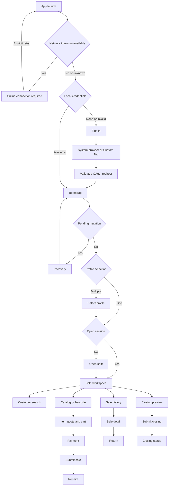

# Android Mobile POS Product Requirements

This document defines Android-specific product behavior for the Roti Ropi
Mobile POS. ERPNext business rules and v1 payload schemas remain authoritative
in the `roti_ropi_pos` repository under `docs/mobile-pos/`.

## Contract Authority

Android consumes only the approved versioned Mobile POS API.

The business API remains limited to the 14 approved v1 endpoints. OAuth is a
separate authentication control plane. Android may launch only the fixed
canonical-origin authorization path and may exchange or refresh tokens only at
the fixed canonical-origin token path. This narrow exception does not authorize
generic Frappe method dispatch.

The following backend documents are normative. Five reviewed snapshots are
stored under [`backend/`](backend/README.md) for Android implementation agents:

- [`product-requirements.md`](backend/product-requirements.md): product scope and business rules.
- [`authentication.md`](backend/authentication.md): server OAuth and authorization behavior.
- [`api-contract.md`](backend/api-contract.md): endpoint inventory, DTO shapes, and stable errors.
- [`idempotency-and-recovery.md`](backend/idempotency-and-recovery.md): mutation and replay contract.
- [`integration-boundaries.md`](https://github.com/Muhayustrid/roti_ropi_pos/blob/b2a09d2/docs/mobile-pos/integration-boundaries.md): ERPNext, Frappe, and bakery ownership.
- [`testing-strategy.md`](https://github.com/Muhayustrid/roti_ropi_pos/blob/b2a09d2/docs/mobile-pos/testing-strategy.md): backend and cross-system gates.
- [`implementation-plan.md`](https://github.com/Muhayustrid/roti_ropi_pos/blob/b2a09d2/docs/mobile-pos/implementation-plan.md): backend implementation phases.

If Android documentation conflicts with those documents, implementation stops
until the contract owners approve one consistent decision.

## Goal

Provide an Android cashier application that completes the approved Mobile POS
lifecycle on API 23 and newer devices while ERPNext remains the sole authority
for customers, sessions, prices, discounts, taxes, stock, UOM conversion,
batches, serials, payments, invoices, returns, and closing.

## Users

- Cashiers authenticate as individual ERPNext users with `Mobile POS Cashier`.
- Managers continue to use ERPNext Desk for provisioning, cancellation, failed
  closing review, and server token revocation.
- Shared, Administrator, API-key, Basic, and service-account credentials are
  prohibited.

## Screen and Navigation Flow

Back navigation must never repeat a mutation. A successful or unknown-result
mutation leaves the submission screen through persisted recovery state, not
through an in-memory navigation flag.

## Functional Requirements

| ID | Android requirement |
| --- | --- |
| AND-FR-1 | Launch authorization in the system browser or secure Custom Tab using OAuth 2.0 Authorization Code with PKCE S256. |
| AND-FR-2 | Validate OAuth state, exact redirect URI, authorization response, and single-use code before token exchange. |
| AND-FR-3 | Call bootstrap after authentication and use server capabilities to enable or hide mutations. |
| AND-FR-4 | Let the cashier select an assigned profile when more than one is returned. |
| AND-FR-5 | Display prior-day `STALE_OPENING` as an informational warning without blocking sales. |
| AND-FR-6 | Collect configured opening balances and submit one idempotent opening request. |
| AND-FR-7 | Search existing customers with bounded pagination and use the default walk-in customer when selection is omitted. |
| AND-FR-8 | Accept an optional walk-in display name only for the server-identified default walk-in customer. |
| AND-FR-9 | Search the catalog with pagination and display price and stock as non-authoritative snapshots. |
| AND-FR-10 | Resolve barcode, UOM, batch, and serial values through the approved scan and quote endpoints. |
| AND-FR-11 | Keep cart state in memory, cap it at 50 distinct rows, and never present locally derived values as authoritative totals. A row is identified by server-resolved item, UOM, and batch context; selected serial numbers are unique across the cart. |
| AND-FR-12 | Refresh an item quote after customer, quantity, UOM, batch, or serial changes and cancel obsolete quote requests. |
| AND-FR-13 | Submit only fully settled sales using server-approved payment modes and an authoritative accepted total. |
| AND-FR-14 | Display the receipt only from the terminal server response, including authoritative totals and business reference. |
| AND-FR-15 | List scoped POS Invoice history with bounded pagination and display sale details and walk-in names. |
| AND-FR-16 | Submit item returns with a required reason and server-authoritative limits and refund values. |
| AND-FR-17 | Display closing preview, collect counted balances, submit once, and handle draft, queued, submitted, failed, and cancelled states. |
| AND-FR-18 | Persist every mutation UUID, exact request body, endpoint, user, normalized HTTPS origin, OAuth client identity, and recovery state before sending. |
| AND-FR-19 | Recover timeout, connection loss, HTTP 401, process death, and queued closing without creating a new key for the same logical action. |
| AND-FR-20 | Remove credentials and sensitive cached responses on logout when no mutation has an unknown result. |
| AND-FR-21 | When connectivity is known unavailable, preserve local input, show that no transaction was submitted, generate no UUID, create no pending mutation, schedule no worker, and invoke no transport. Connectivity restoration never starts that never-prepared action, but may satisfy the network constraint of an already persisted eligible mutation. |
| AND-FR-22 | Refresh bootstrap capabilities only at the documented authentication, profile, mutation, and recovery trigger points and coalesce concurrent refresh requests. |

## UI State Requirements

- One activity hosts XML fragments through an AndroidX navigation graph.
- A screen ViewModel owns render state, events, and cancellable requests.
- ViewBinding exists only between `onCreateView` and `onDestroyView`.
- Activity and Fragment instances never own tokens, API clients, or durable
  transaction state.
- Unsubmitted cart state survives configuration changes but is not an offline
  sale and may be discarded after process death.
- A persisted pending mutation takes precedence over starting another mutation.
- Loading, empty, recoverable-error, terminal-error, and content states are
  explicit and accessible.
- A known-offline mutation attempt preserves current input and displays an
  accessible `Online connection required` state with explicit Retry. Network
  restoration never starts that never-prepared action automatically. It may
  resume only an already persisted eligible mutation through its recovery
  workflow.

## Non-Functional Requirements

### Platform

- Application code uses Kotlin.
- UI uses XML Views and ViewBinding.
- `minSdk` remains 23.
- Jetpack Compose is excluded without separate explicit approval.
- API 23 and target API 36 are release test targets.

### Security

- HTTPS is mandatory and cleartext traffic is rejected.
- No client secret, API key, password, shared credential, token, code verifier,
  authorization code, or Administrator data may be embedded or logged.
- Access and refresh tokens use Android Keystore-backed encryption.
- Credentials and pending sensitive bodies are excluded from cloud backup and
  device transfer.
- Only AppAuth's exact exported redirect receiver may accept the approved URI;
  it completes into an explicit non-exported activity.
- Incoming redirect data is validated on both cold and warm activity delivery.

### Reliability

- Every mutation uses one lowercase UUID generated before persistence.
- The exact serialized body and UUID are reused after an unknown result.
- HTTP 401 pauses mutation retries until the same cashier is authenticated.
- No sale, return, opening, or closing is assumed successful from local state.
- The MVP has no offline sale submission or offline ledger.
- A mutation rejected before transmission because connectivity is known
  unavailable has no transaction UUID or durable mutation record.

### Performance

- Customer, catalog, and history pages default to 20 and never exceed the
  server maximum of 100.
- Search input is debounced by 300 ms and obsolete requests are cancelled.
- The cart is bounded to 50 distinct rows.
- Network, encryption, and persistent storage never run on the main thread.
- No polling is used except bounded closing-status recovery.
- Catalog images are not required for the MVP; no image framework is added.
- Repeated navigation and 50 sequential sale cycles must not show unbounded
  memory growth or an out-of-memory failure. The fixed API 23 AVD supplies
  repeatable regression evidence; final performance acceptance additionally
  requires a separately approved representative low-end physical device.

### Accessibility

- All controls have visible labels or content descriptions.
- Touch targets are at least 48 dp.
- Errors move accessibility focus or announce their message.
- Color is never the only state indicator.
- Core journeys work with TalkBack, external keyboard/scanner input, and
  font scale 1.5 without clipped actions or hidden totals.
- Portrait and landscape are supported without forcing orientation.

## Explicit Exclusions

- Jetpack Compose.
- Generic Frappe resource or arbitrary method calls, except the exact approved
  OAuth authorization and token control-plane routes.
- Local authoritative accounting calculations.
- Offline sale submission or an offline ledger.
- Sales Invoice mode.
- Partial payment.
- Mobile cancellation.
- Customer creation or modification.
- Manager mobile workflows.
- Camera barcode scanning until separately approved.
- Receipt printing or printer integration.
- Real-time stock polling.
- Manual inventory browsing for UOM, batch, or serial selection.
- Health and return-preview endpoints.
- Android-owned staging response-drop proxy or staging ingress configuration.
- Overpayment collection and Android change calculation or presentation.
- Production deployment automation.
- R8 optimization changes.
- Analytics or crash-reporting SDKs.

## Acceptance Criteria

The Android MVP is accepted only when:

1. A cashier completes sign in, bootstrap, opening, customer selection, catalog
   or scan, sale, receipt, history, return, closing, and logout.
2. The workflow uses only approved v1 endpoints and an individual cashier.
3. The app runs on API 23 and target API 36 with XML Views and ViewBinding.
4. OAuth uses mandatory PKCE S256 and contains no client secret.
5. Invalid state, redirect, verifier, replayed code, and wrong-user callbacks
   are rejected.
6. Every accepted mutation survives lost responses and process death with one
   UUID and exactly one server business document; a rejected or never-sent
   mutation creates none.
7. A 401 preserves pending recovery and prevents unauthenticated mutation retry.
8. No local value is represented as an authoritative price, tax, payment,
   return, stock, or accounting total.
9. Lists remain paginated and memory use remains bounded.
10. The full cashier journey is operable with TalkBack and external scanner
    input.
11. Debug and release unit, lint, build, contract, and instrumentation gates pass.
12. APK and merged configuration inspection finds no forbidden credential.
13. Backend integration gates for the active Android phase are green.
14. No unresolved hard blocker is bypassed by Android-only behavior.
15. Known-offline mutation attempts preserve input while creating and sending
    nothing.
16. Capability refreshes occur only at authoritative trigger points and cannot
    create a refresh loop.

## Decisions and Blockers

| Item | Phase 0 position |
| --- | --- |
| Gradle baseline | Hard blocker. Task 1A must obtain explicit approval for the smallest compatible dependency correction or `compileSdk 37`; it must not change `minSdk 23` or `targetSdk 36` merely to satisfy metadata. |
| Redirect URI | Hard blocker. Require a verified HTTPS App Link; a custom scheme needs separate explicit approval. Implementation waits for one exact approved URI and signing association. |
| Site configuration | Hard blocker. Base URL, client ID, authorization and token paths, scope, test-cashier provisioning, and the non-cashier-editable configuration provisioning method require approval. |
| Payment modes | Hard blocker. Backend must expose the allowed opening and sale payment modes. |
| Sale total | Hard blocker. Backend must provide an authoritative payable-value workflow before payment UI implementation. |
| Return refund | Hard blocker. Backend must provide an authoritative refund-value workflow before return submission implementation. |
| Overpayment and change | Unsupported. Backend delegates overpayment behavior to ERPNext core but does not approve an Android request-construction or cashier UX flow. Support requires a separate contract decision. |
| OAuth attempt lifetime | Proposed default is 10 minutes. A different value requires explicit approval before Task 3. |
| Decimal input | Hard blocker for amount-entry tasks. Backend/product owners must approve accepted locale syntax, precision, scale, bounds, and the prohibition on Android rounding. |
| Serial requote | Hard blocker for serial-sensitive Task 8 behavior. Backend/product owners must decide whether serial changes require an identical quote refresh or a contracted serial-aware quote input. |
| Lost-response evidence | Hard blocker for Tasks 6, 9, 10, 11, and Final. An external owner must approve the one-shot post-upstream-completion fault protocol and evidence schema for all four mutations. |
| Queued closing | Hard blocker for Task 11 staging evidence. An external owner must provide a deterministic staging-only queued-closing procedure without an Android endpoint, production test hook, or Android-owned worker control. |
| Performance thresholds | UI-flow p95 of 250 ms and PSS growth below 20 MiB remain proposed, not approved pass gates. Final completion requires approved UI-flow-p95, PSS-growth, launch-p95, and representative request-p95 thresholds. |
| Performance device | Hard blocker for Final. The representative low-end physical device model, API level, hardware state, and ownership must be approved; the fixed AVD remains regression evidence only. |
| Release denylist | Hard blocker for Final artifact inspection. A release/security owner must supply a non-empty external denylist without storing or printing its values. |
| Barcode capture | MVP uses HID/keyboard-wedge or manual input; camera is excluded. |
| Orientation | Do not lock orientation; support portrait and landscape. |
| Receipt | On-screen server receipt only. |
| Cart bound | Maximum 50 distinct rows. |
| Stock | Display snapshots; no polling or guarantee before submit. |
| Distribution | Does not block development, but publishing waits for a separately approved distribution and signing decision. |
| Backend documentation alignment | Requires a separately requested backend-repository documentation diff. Factual stale-text cleanup and product/contract decisions must be reviewed independently and never begin from Android approval alone. |
